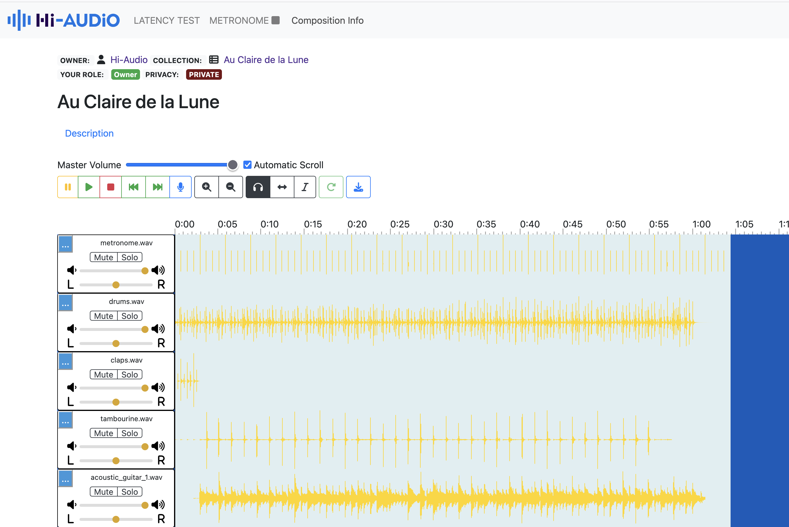

## About

Hi-Audio online platform is a collaborative web application for musicians and researchers in the MIR (Music Information Retrieval) domain, with a view to build a public database of music recordings from a wide variety of styles and different cultures. It allows:

- Creating musical compositions and collections with different levels of privacy.
- Uploading and recording audio tracks from the browser.
- Annotating audio tracks with relevant MIR information.
- Inviting collaborators to participate using different roles.



This repo contains information relative to the server side or back-end, for the client side (web application) check the following repo:

https://github.com/idsinge/hiaudio_webapp


## General usage:

### Recommended Python version 3.10


```bash
git clone https://github.com/idsinge/hiaudio_backend.git

cd hiaudio_backend

# create python virtualenv
python3 -m venv venv

# activate virtualenv
. venv/bin/activate

# install requirements
pip install -r requirements.txt

# Create .env file with the following content
# Google Values: https://console.cloud.google.com/apis/credentials
# SECRET_KEY is independent and can be self-elected
# JWT_SECRET_KEY: https://flask-jwt-extended.readthedocs.io/en/stable/options.html#JWT_SECRET_KEY
# OVH_EMAIL_PASSWD: https://www.ovh.com/manager/#/web/email_domain/
# ACOUSTIC_ID_API_KEY: https://acoustid.org/
GOOGLE_CLIENT_ID=*****
GOOGLE_CLIENT_SECRET=*****
SECRET_KEY=*****
JWT_SECRET_KEY=*****
OVH_EMAIL_PASSWD=*****
ACOUSTIC_ID_API_KEY=*****


# For Mac, for Linux see (Note 2) below
# More info about DB migration in Note 3.
brew install mysql

# Start MySQL server
mysql.server start

# Login as root
mysql -u root -p

# Then create DB and add new user (mysqluser) at localhost
create database hiaudio ; 
CREATE USER 'mysqluser'@'localhost' IDENTIFIED BY 'hiaudio';
GRANT ALL PRIVILEGES ON hiaudio.* TO 'mysqluser'@'localhost';
FLUSH PRIVILEGES;

mysql > exit

# When finished MySQL setup then run
pip install mysqlclient

# Duplicate config.py.sample and rename it to config.py

# At config.py check default option for MySQL connection is:
DB_CNX = f"mysql://{MYSQL_USER}:{MYSQL_PASS}@{MYSQL_HOST}/{MYSQL_DB}"

# In config.py fill the following details:
MYSQL_HOST="localhost"
MYSQL_USER="mysqluser"
MYSQL_PASS="password"
MYSQL_DB="hiaudio"

# In config.py for Mail settings go to Email provider:
MAIL_SERVER = ""
MAIL_PORT = 0
MAIL_USERNAME = ""

# To initialize the DB:
python initdb.py

# run the server 
python app.py

# Verify it's running
Open -> https://localhost:7007/

```

## To make the frontend repo work together with the backend in local DEV mode/environment


Inside backend repo clone (see **NOTE 1**):
```
git clone https://github.com/idsinge/hiaudio_webapp.git

```

Then rename the folder `hiaudio_webapp` to `webapp`

**Hint**: during development it might be useful to temporarly ignore the contents of the public directory, this can be done with

```
# ignore public/ contents for git diff, grep, status, etc.
git ls-files -z public/ | xargs -0 git update-index --skip-worktree

# track the contents of public/ again (when commiting changes to it for example)
git ls-files -z public/ | xargs -0 git update-index --no-skip-worktree
```

## COMPRESSION MODULE

In order to run the compression module locally, the env variable `COMPRESSION_MODULE_ACTIVE` at `config.py` needs to be set to `True`. It's required to execute the follwoing commands, the first for the installation of the `pydub` package (see **NOTE 3**) and the other to run the thread. 

```bash
pip install pydub

python compress_thread.py
```


## AUDIO PROCESSING MODULE

To use the [Acoustic ID API ](https://acoustid.org/) for audio identification, the environment variable `ACOUSTIC_ID_API_KEY` needs to be set at `.env`. It's required to execute the follwoing commands, for the installation of `pydub` (see **NOTE 3**) and `essentia-tensorflow` (see **NOTE 4**) in order to run the audio processing service.

```bash
pip install pydub

pip install essentia-tensorflow

pip install torch # for instrument recognition - AST

pip install torchaudio # for instrument recognition - AST

pip install soundfile # for instrument recognition - AST

pip install timm==0.4.5 # for instrument recognition - AST

python process_audio_thread/process_audio_thread.py
```


## NOTES:
1- [Web App Repo](https://github.com/idsinge/hiaudio_webapp)

2- Flask-Migrate: https://flask-migrate.readthedocs.io/en/latest/#example

3- [Install FFMPEG](https://gist.github.com/barbietunnie/47a3de3de3274956617ce092a3bc03a1). `pydub` needs either `sudo apt install ffmpeg` (Linux) or `brew install ffmpeg` (Mac) in order to function correctly. 

4- In order to make essentia python library to work in the backend this is required: `pip install "numpy<2.0"`.
